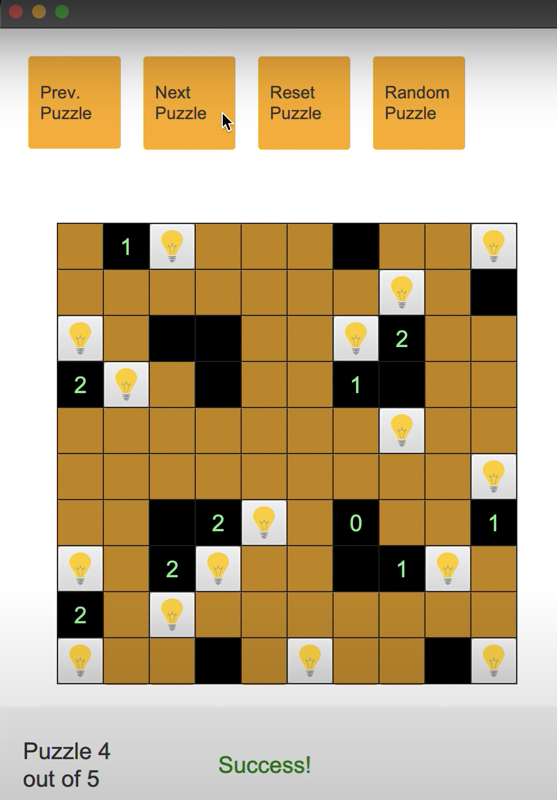
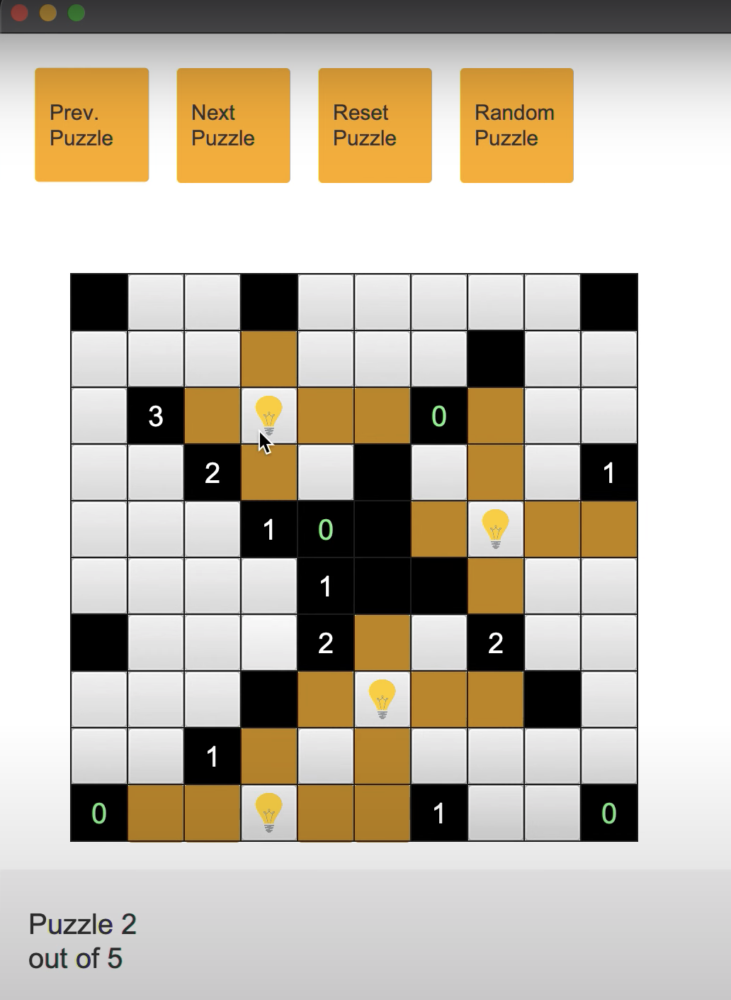
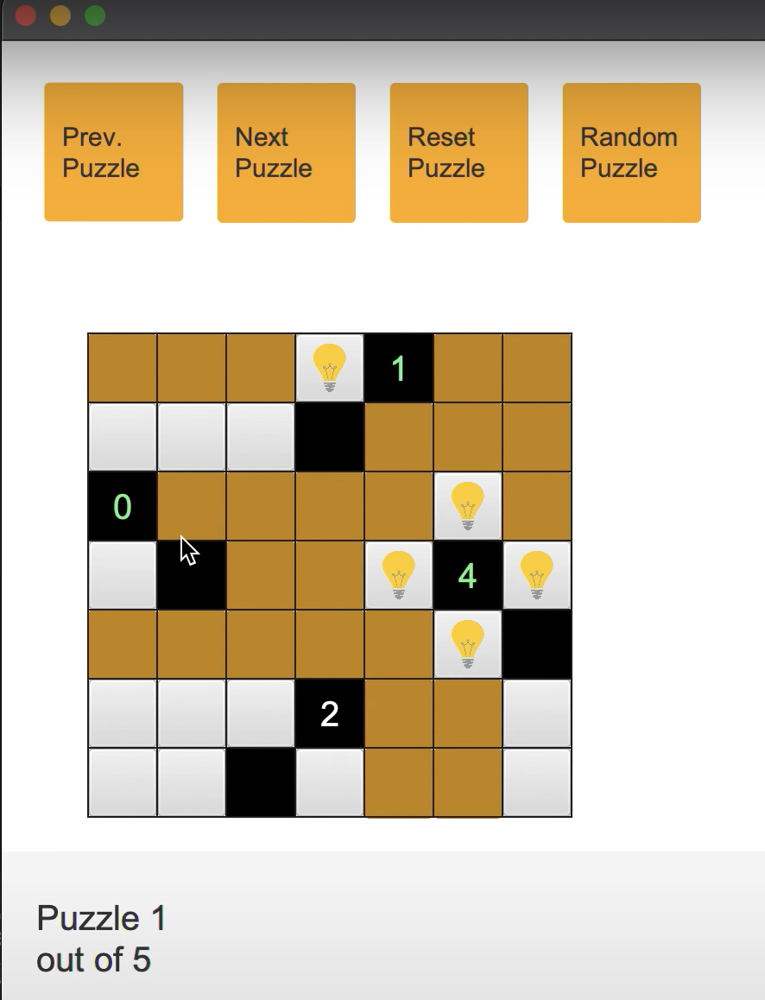

# Akari Game

### Description
This was my final project for Comp 301 (Foundations of Programming) at UNC Chapel Hill. I implmented a single-player akari game. The model-view-controller disign pattern was used together with the JavaFX UI library.  

Players can play with the available puzzles that include visual cues indicating succefulul completion. A player may intuitively navigate through the available puzzles and navigate to a random puzzle. 

### Images 

